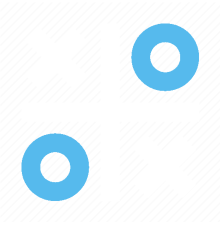

   

## about
This project is a tic-tac-toe game implemented in HTML, CSS and JavaScript. Here are some notes about the project and how the game works.

## game operation
* Objective: Player X and player O take turns clicking on empty spaces on the board to mark with their respective symbols (X or O). The objective is to get three identical symbols in a line (horizontal, vertical or diagonal) before the opponent, or fill the entire board without a winner.

* Animations and Visual Feedback: Uses animations for smooth transitions and visual feedback through sliders and color changes to indicate whose turn it is to play.

## attention
For play the game just click on the image or click in that link <a href="https://iamlucasmagalhaes.github.io/tic-tac-toe/" style = "text-decoration: underline;" >Tic-Tac-Toe</a>
